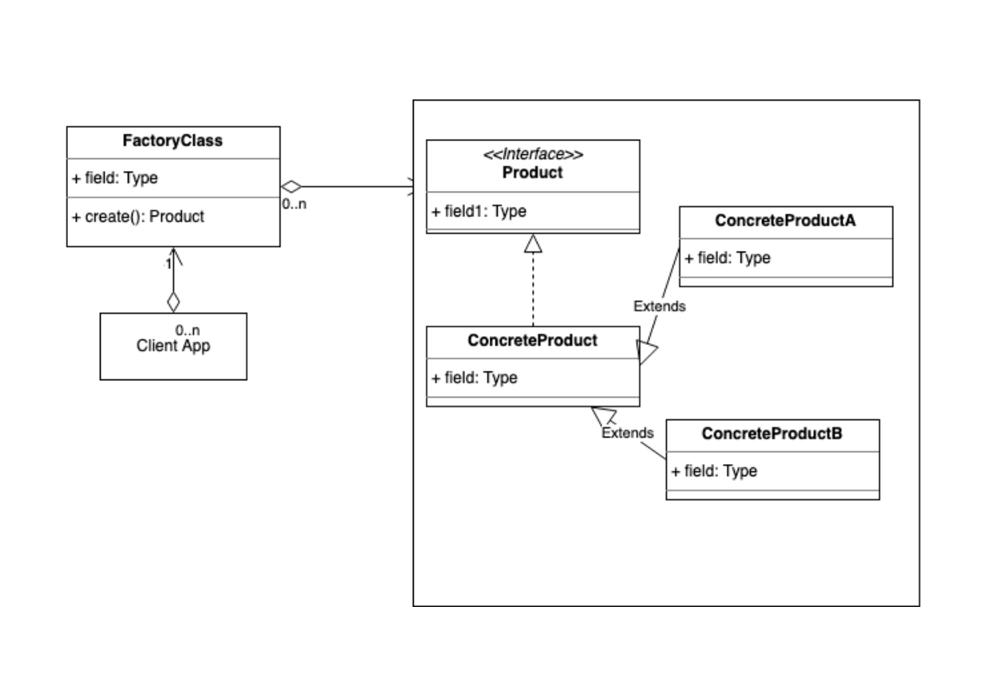
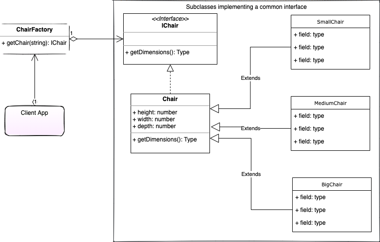

# Factory pattern

## Concept

- The factory Pattern is an interface that defers the creation of the final object to a subclass.
- The factory Pattern is about inserting another layer/abstraction between instantiating an object and where in your code it is actually set.
- It is unknown what or how many objects your will need to be created until runtime.
- You want ot localize knowledge of the specifics of instantiating a particular object to the subclass so that the client doesn't need to be concerned about the details.
- You want to create an external framework, that an application can import/reference, and hide the details of the specifics involved in creating the final object/product.
- The unique factor that defines the factory pattern, is that your project now defers the creation of objects to the subclass that the factory had delegated it to.

## Example

## Documentation

[https://sbcode.net/typescript/factory/#factory-use-case](https://sbcode.net/typescript/factory/#factory-use-case)
